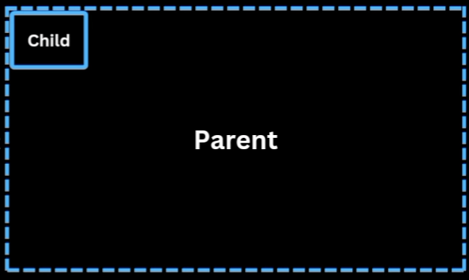

# CSS

## CSS Positioning


```html
<div class="parent">
    <div class="child"> Child</div>
</div>
```

```css
.parent{
    position:relative;
    width:100%;
    height:100%;
}   

.child{
    position:absolute;
    width:50px;
    height:50px;
}

.child{
    bottom:0;
    //right:0;
    //top:50%;
    //left:50%;
    //transform: translate(-50%,-50%);
}
```


# Tools

[UNIVERSE.IO]( https://uiverse.io/)

Open-Source UI elements

